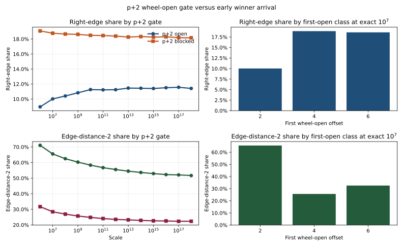

# $p+2$ Wheel-Open Gate Splits Early Selected integer Arrival

This note records one residue-conditioned refinement of the gap-ridge result.

## Finding

On the tested surface, whether the first odd interior site $p+2$ is already
coprime to $30$ splits the ridge into two early-arrival regimes.

If $p+2$ is wheel-open, the selected interior integer lands much earlier and much more often
at edge distance $2$. If $p+2$ is blocked by $3$ or $5$, early left arrival is
materially delayed.

This is best read as an early-arrival gate, not as a full replacement for the
leftmost minimizer rule. On the tested surface, the binary split between
"$p+2$ open" and "$p+2$ blocked" is stronger than the finer first-open offset
ladder for right-edge share.

## Visual Evidence

Artifacts:

- [p2_wheel_gate_split.svg](../../benchmarks/output/python/gap_ridge/insight_probes/p2_wheel_gate_split.svg)
- [p2_wheel_gate_split.json](../../benchmarks/output/python/gap_ridge/insight_probes/p2_wheel_gate_split.json)
- [residue_mod30_right_edge_share.svg](../../benchmarks/output/python/gap_ridge/insight_probes/residue_mod30_right_edge_share.svg)
- [residue_mod30_right_edge_share.json](../../benchmarks/output/python/gap_ridge/insight_probes/residue_mod30_right_edge_share.json)

## Tested Surface

At exact `10^7`:

- $p+2$ open ($p \bmod 30 \in \{11,17,29\}$): right-edge share `10.0141%`,
  edge-distance-`2` share `65.5362%`, left share `85.5402%`
- $p+2$ blocked ($p \bmod 30 \in \{1,7,13,19,23\}$): right-edge share
  `18.7767%`, edge-distance-`2` share `28.4154%`, left share `70.8813%`

The finer first-open classes at exact `10^7` are:

- first open `2`: right-edge share `10.0141%`, edge-distance-`2` share
  `65.5362%`
- first open `4`: right-edge share `18.8943%`, edge-distance-`2` share
  `25.6530%`
- first open `6`: right-edge share `18.6002%`, edge-distance-`2` share
  `32.5583%`

The binary gate remains visible on the sampled ladder through `10^18`:

- $p+2$ open: right-edge share `11.4107%`, edge-distance-`2` share `51.6673%`
- $p+2$ blocked: right-edge share `18.1580%`, edge-distance-`2` share
  `22.3441%`

The split also survives exact gap-size conditioning at `10^7`:

- gaps `4-10`: open edge-distance-`2` share `80.9096%`, blocked `41.4588%`
- gaps `12-20`: open `58.5503%`, blocked `18.5800%`
- gaps `22+`: open `59.3763%`, blocked `14.5571%`

## Plain Reading

The residue effect is not only a cosmetic orientation label.

It acts like a gate on how soon the left endpoint can first host a
wheel-admissible low-divisor carrier.

That is why this finding is best described as an early-arrival law:

- $p+2$-open gaps enter the race immediately
- $p+2$-blocked gaps usually do not
- and the early-arrival split persists even after conditioning on gap size

## Related Notes

- [Residue-modulated ridge orientation](./residue_mod30_ridge_orientation.md)
- [Leftmost minimizer-take-all peak rule](./lexicographic_winner_take_all_peak_rule.md)
