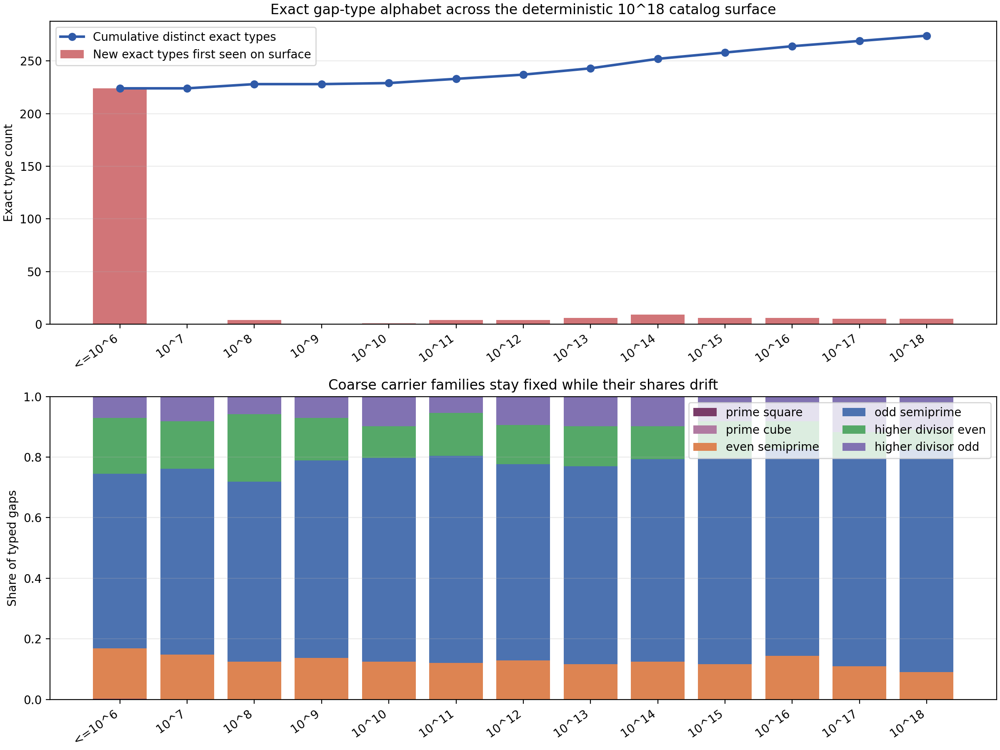

# Gap-Type Catalog Through 10^18

This note records a direct catalog of the distinct exact `GWR`/`DNI` gap types
currently visible on the repo's deterministic cross-scale surface.

The strongest supported finding is:

On the current catalog surface, the exact gap-type alphabet does grow beyond
the full exact `10^6` baseline, but the coarse family scaffold does **not**
expand.

More concretely:

- the full exact surface through `current_right_prime <= 10^6` contains
  `78,497` typed gaps and `224` distinct exact type keys;
- adding deterministic sampled decade windows from `10^7` through `10^18`
  raises the observed exact alphabet to `274` types, so only `50` exact types
  are new beyond the baseline;
- all observed types still sit inside the same `6` carrier families:
  `prime_square`, `prime_cube`, `even_semiprime`, `odd_semiprime`,
  `higher_divisor_even`, and `higher_divisor_odd`;
- the post-baseline growth is carried entirely by
  `odd_semiprime`, `even_semiprime`, `higher_divisor_even`, and
  `higher_divisor_odd` variants;
- no new first-open offsets appear beyond `2, 4, 6`;
- the largest observed winner offset on the catalog surface is `50`;
- the largest observed minimum divisor class on the catalog surface is `560`.

So the clean current reading is:

the exact type list keeps growing mainly because the arrival offset `a` and the
winner class `d` still admit new high-scale combinations, but the structural
categories themselves look stable.

## Artifacts

- runner:
  [`../../benchmarks/python/predictor/gwr_dni_gap_type_catalog.py`](../../benchmarks/python/predictor/gwr_dni_gap_type_catalog.py)
- tests:
  [`../../tests/python/predictor/test_gwr_dni_gap_type_catalog.py`](../../tests/python/predictor/test_gwr_dni_gap_type_catalog.py)
- JSON summary:
  [`../../output/gwr_dni_gap_type_catalog_summary.json`](../../output/gwr_dni_gap_type_catalog_summary.json)
- detail CSV:
  [`../../output/gwr_dni_gap_type_catalog_details.csv`](../../output/gwr_dni_gap_type_catalog_details.csv)
- overview plot:
  [`../../output/gwr_dni_gap_type_catalog_overview.png`](../../output/gwr_dni_gap_type_catalog_overview.png)

## Type Definition

The exact classifier already used in the repo writes one stable type key as

`o{first_open}_d{winner_d}_a{winner_offset}_{family}`.

In ordinary language:

- `o` records the first wheel-open even offset after the current right prime;
- `d` records the minimum divisor class that actually wins in the next gap;
- `a` records the leftmost offset where that winning class first appears;
- `family` records what kind of carrier that winner is.

That means one exact type is not just a family label. It is a full local gap
signature.

## Catalog Surface

The catalog uses one deterministic two-part surface:

1. the full exact type surface through `current_right_prime <= 10^6`;
2. a deterministic sampled window of `256` consecutive typed gaps starting at
   the first prime `>= 10^m` for each decade `m = 7, 8, ..., 18`.

That produces:

- `78,497` exact baseline rows;
- `3,072` sampled decade-window rows;
- `81,569` typed rows in the combined catalog.

This is a real cross-scale catalog through `10^18`, but it is **not** a claim
that every typed gap through `10^18` has been enumerated. The exact claim is
the catalog surface above.

## Distinct Type Categories

On the current surface, the natural category split is:

1. **Prime-square intrusion types**
   These are the `d = 3` winners, all inside the `prime_square` family.
   They are real on the exact baseline, but they do not create new families at
   higher sampled decades.

2. **Prime-cube types**
   These are `d = 4` winners whose carrier is exactly a prime cube.
   They are extremely rare on the current surface and stay rare enough that the
   high-decade windows did not add new cube families.

3. **Even-semiprime types**
   These are `d = 4` winners carried by an even semiprime.
   They remain part of the cross-scale scaffold, but their share falls with
   scale on the sampled windows.

4. **Odd-semiprime types**
   These are `d = 4` winners carried by an odd semiprime.
   This is the dominant family on every sampled decade window and becomes more
   dominant by `10^18`.

5. **Higher-divisor even types**
   These are winners with `d >= 6` on an even carrier.
   They persist at every sampled scale and account for many of the new
   high-scale exact types.

6. **Higher-divisor odd types**
   These are winners with `d >= 6` on an odd carrier.
   They also persist at every sampled scale and pick up new late-arrival
   variants at high decades.

The key hidden variable is that the exact type key includes the arrival offset
`a`. So the exact alphabet can grow even when the family scaffold does not.

## Main Counts

### Exact Alphabet Growth

- exact baseline `<=10^6`: `224` distinct exact types;
- combined catalog through the sampled `10^18` surface: `274` distinct exact
  types;
- post-baseline additions: `50` exact types;
- exact types present on **every** catalog surface: `22`.

The new-type cadence is thin rather than explosive:

- `10^7`: `0` new exact types;
- `10^8`: `4`;
- `10^9`: `0`;
- `10^10`: `1`;
- `10^11`: `4`;
- `10^12`: `4`;
- `10^13`: `6`;
- `10^14`: `9`;
- `10^15`: `6`;
- `10^16`: `6`;
- `10^17`: `5`;
- `10^18`: `5`.

So the alphabet does not freeze at the exact-key level, but it also does not
explode uncontrollably. It accretes.

### Family Stability

Among the `50` exact types first seen beyond the `10^6` baseline:

- `17` are `odd_semiprime`;
- `16` are `higher_divisor_even`;
- `11` are `higher_divisor_odd`;
- `6` are `even_semiprime`;
- `0` are `prime_square`;
- `0` are `prime_cube`.

So the post-baseline growth adds new **variants** inside old families, not new
families.

### Divisor-Class Growth

Among post-baseline new exact types:

- `23` have `d = 4`;
- `6` have `d = 8`;
- `6` have `d = 16`;
- the remainder are sparse higher classes, including single new winners at
  `d = 224, 240, 256, 288, 384, 432, 512, 560`.

This again says the growth is not mainly a new-family story. It is a new
arrival-shape and high-divisor-tail story.

## Selected Surface Snapshots

| Surface | Typed gaps | Distinct exact types | New exact types on surface | Max offset `a` | Odd-semiprime share |
|---|---:|---:|---:|---:|---:|
| `<=10^6` | `78,497` | `224` | `224` | `48` | `57.67%` |
| `10^12` window | `256` | `65` | `4` | `50` | `64.84%` |
| `10^15` window | `256` | `80` | `6` | `38` | `67.97%` |
| `10^18` window | `256` | `76` | `5` | `30` | `73.44%` |

Two drifts are visible:

- odd-semiprime dominance strengthens with scale on the sampled windows;
- even-semiprime share weakens while higher-divisor odd types stay present.

## Representative High-Scale First-Seen Types

Concrete examples of exact types first seen above the `10^6` baseline include:

- `o2_d4_a50_odd_semiprime`, first seen on the `10^12` window;
- `o2_d4_a38_odd_semiprime`, first seen on the `10^15` window;
- `o4_d32_a3_higher_divisor_even`, first seen on the `10^15` window;
- `o2_d512_a1_higher_divisor_even`, first seen on the `10^17` window;
- `o4_d4_a25_even_semiprime`, first seen on the `10^18` window.

These examples make the mechanism visible:

- some growth comes from much later semiprime arrival offsets;
- some growth comes from rare higher-divisor winners that were absent from the
  `10^6` baseline;
- none of that required a seventh family.

## Core Types

`22` exact types were present on every catalog surface.

Representative examples include:

- `o2_d4_a2_odd_semiprime`
- `o4_d4_a4_odd_semiprime`
- `o6_d4_a2_odd_semiprime`
- `o4_d4_a1_even_semiprime`
- `o6_d4_a3_even_semiprime`
- `o2_d8_a2_higher_divisor_odd`

So there is already a visible core alphabet that survives from the exact low
surface all the way out to the sampled `10^18` windows.

## Interpretation

Attached to the catalog surface, the cleanest reading is:

1. prime gaps do admit a real typed anatomy;
2. that anatomy is not well described by gap width alone;
3. the exact alphabet does not collapse to one small finite list by `10^18`,
   because new arrival-offset and high-divisor variants still appear;
4. but the coarse family scaffold looks strongly stable.

So if the next question is sequence or recurrence, the natural object to track
is probably **not** the raw exact type key alone.

The more promising next objects are:

- transitions among the stable carrier families,
- transitions among the divisor class and first-open components,
- or a mixed state that preserves the stable scaffold while factoring out the
  unbounded arrival-offset tail.

## Conclusion

On the current deterministic catalog surface through the sampled `10^18`
windows, prime gaps do sort into a clear and stable family scaffold, but the
full exact type alphabet keeps growing by accretion.

There may be something here.

The current evidence says the repeatable part is not "one short fixed list of
exact type keys." The repeatable part is the stable geometric scaffold inside
which new delayed-arrival and higher-divisor variants keep appearing.
